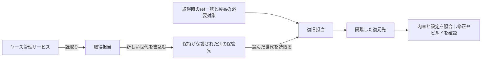

# ENG-SOURCE-005: Independent repository backup and restore

ソース管理者の権限を失っても、別の権限で保管した世代から修正作業を再開する設計です。リポジトリ管理者とバックアップ担当が、保存方式・権限・復元範囲を決めるために使います。

例えば管理者セッションでリポジトリを削除されても、取得担当には過去の世代を消せないようにします。復旧担当は残った世代を隔離先へ戻し、製品が必要とする履歴・データ・設定を確認してから開発を再開します。[SOURCE-005](../../../controls/records/source-protection/psb-source-005-repository-recovery-independence/README.md)のRECOVERY-1〜6を設計へ具体化します。

## まず復旧の単位を決める

「リポジトリを保存する」という単位だけでは不足します。製品の責任者が次の三つを選び、各項目の取得元と復元方法を決めます。

| 復旧対象 | 選ぶもの・確認すること |
|---|---|
| Gitの内容 | 固定したrepository ID、必要なrefとobject ID、到達可能な履歴。LFS実体とsubmoduleの別repositoryは別に選ぶ |
| サービス側のデータ | 必要なIssues、PR、Release添付、wiki、Packages等。Exportの存在だけでなく復元先・対応形式を確認する |
| 開発再開の設定 | Default branch、ruleset、team・App権限、workflowと接続先。旧Secretsをそのまま戻すかは漏えいの原因を踏まえて判断する |

取得時の一覧は「今回見えたもの」です。製品の必要対象と照合しなければ、すでに消えたタグや台帳から漏れたリポジトリを検出できません。取得中にrefが変わる場合も、比較可能な時点を確保するか、取得をやり直します。

## 権限を配置する

ソース側では削除・移管、refの削除・force push、例外権限、制限を編集できる主体を管理します。ブランチのrulesetとリポジトリ自体の削除権限は別です。GitHub固有の選択肢と制約は[資料記録](../../../sources/README.md#ref-repository-recovery-001)に残しています。

取得担当には必要なソースの読取りと新世代の書込みを渡し、保管済み世代の削除・保持短縮を渡しません。保管先の管理者、暗号鍵の管理者、復旧用IDも確認します。同じSSO管理者やcloud管理者を奪うと全て消せるなら、その共通権限を残存リスクとして扱います。

保持の保護は復元可能性と別です。例えばS3 Object Lockは指定したobject versionを保護する一方、新しいversionやdelete markerを作る操作まで禁止するものではありません。採用時には、保護したversionを指定して取り出せることと、鍵・account管理の経路も確認します。特定のstorageや保持modeを全組織に要求しません。

## 保存方式を選ぶ

| 方式 | 選びやすい条件 | 代償・失敗経路 |
|---|---|---|
| Git mirrorを世代ごとに保管 | まずGitの履歴とrefを確実に戻したい | サービス側のデータやLFS実体は別。作業用cloneでは保守ブランチを取りこぼすことがある |
| Providerのexport・backup機能 | 必要なmetadataと復元先の対応が分かっている | Exportできても復元できるとは限らない。対応データ・版・restore手順を確認する |
| Backup製品と保管先の保持機能 | 複数repositoryと設定・関連データの運用をまとめたい | 製品の対応範囲、writer権限、復旧credential、契約終了時の取出しに依存する |

Mirrorを同じ場所で更新し続けると、ソース側の削除や不正変更を次の更新で取り込めます。更新用mirrorと、期限まで変更できない保管世代を分けます。世代数・間隔・保持期間はRPOと調査に必要な期間から選びます。古い正常世代を残すことと、古すぎる世代でRPOを満たさないことの両方を見ます。

## 復旧の判断を三段階に分ける

まず採用する世代を選びます。削除の発見時刻だけでなく、不正変更が始まった可能性のある時点を調べ、承認された変更記録や別に保管した期待値と複数世代を照合します。取得時のref一覧はその時点のコピー範囲を示しますが、侵害前の正しさは示しません。判断できない世代は調査用に保全し、最新という理由だけで復旧先へ採用しません。

1. 選んだ実保管世代を取り出せたか。元サービス、旧管理者credential、別の未保管repositoryへの追加取得に頼っていないか。
2. 必要な内容が戻ったか。Gitの整合性とrefの期待値、LFS・関連データの利用可能性を別に確認する。
3. 開発を再開できるか。制限を設定し、侵害原因に応じたID・実行環境で修正やビルドを確かめ、RTOと比較する。

復元したworkflowやスクリプトを、照合前に本番権限で動かしません。調査で不正変更が疑われる世代は、ハッシュが合っても採用判断を保留します。取得・保管・照合・実行の各失敗を担当者へ渡し、再確認が済むまで復旧完了にしません。

## 具体例と適用の境界

[Git mirror実装例](implementations/git-mirror/README.md)では、Git 2.47.2の標準コマンドだけで、取得時のref一覧、独立したobjectコピー、新しいbare repositoryへの復元と比較を試します。タグ欠落・指す先の変更・破損・浅い履歴もローカルで確認します。Cloudの独立権限、保持lock、GitHub設定、LFS、開発再開は採用環境で別に確認します。

IDの発行・失効は[SOURCE-004の設計](../source-access-credential-lifecycle/README.md)、露出後の封じ込めは[GOV-004の設計](../../governance-operations/credential-exposure-containment/README.md)へ接続します。配布済み成果物を置換する[GOV-005](../../governance-operations/deployed-artifact-recovery/README.md)とは復旧対象が異なります。

七レイヤーではplatformとoperations、攻撃段階では2のソース保護と12の復旧を直接扱います。7〜9へは、復元したソースを再評価するための対象・世代・照合結果を渡します。参照資料の版・採否は[REF-REPOSITORY-RECOVERY-001](../../../sources/README.md#ref-repository-recovery-001)、旧実装との関係は[移行記録](../../../docs/MIGRATION_SOURCE_PROTECTION.md#repository-recovery-migration)にあります。
