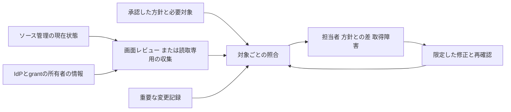

# ENG-SOURCE-006: Organization baseline and drift review

共通の設定方針を対象ごとの現在状態へ照合し、適用漏れ・上書き・確認障害を担当者へ戻す設計です。組織の管理者とセキュリティ担当が、手作業で確認する範囲と自動収集する範囲を選ぶために使います。

例えば移管したrepositoryが新規作成用の既定設定から漏れた場合、対象台帳と現在状態の照合で見つけます。移管イベントだけを待つ設計では、受信が止まったときに漏れが残ります。[SOURCE-006](../../../controls/records/source-protection/psb-source-006-source-organization-security-posture/README.md)のORG-POSTURE-1〜7を具体化します。

## 方針を「何を変えられるか」まで決める

| 決めること | 判断例 |
|---|---|
| 対象 | 固定した組織ID、必要なrepository・主体・App。Public／private／internal、archive、移管も区別する |
| 方針の版と項目 | 認証、初期権限、作成・公開・fork、CI、検査機能。個別の意味は担当controlへリンクする |
| 適用条件 | 全対象共通か、製品・公開範囲・契約等で分かれるか。対象外には理由と確認者を残す |
| 強制と変更権限 | 上位enterpriseで制限するもの、organizationの既定値、repositoryで変更できるもの、管理者のbypass |
| 確認の期限 | 変更の影響、検知したい速さ、取得コストから決める。資料中の固定値をそのまま共通要件にしない |

確認用の方針を弱めて良好な結果を作る経路も、通常の方針変更としてレビューします。正当な用途のAppや外部協力者へ必要なwriteを許す判断はあり得ます。全Appのwriteや全forkを一律禁止することから設計を始めません。

認証情報やAppの方針を変えた場合は、変更後の申請・発行経路と、既存のtoken・承認・installationによる現在のアクセスを別に照合します。方針が既存アクセスを直ちに止めるか、認可が残るか、再有効化で戻るかは設定とproviderごとに異なります。不要な認可の失効と拒否確認は[SOURCE-004](../source-access-credential-lifecycle/README.md)へ渡します。

## 現在状態と変更記録を合わせる

取得時刻、対象ID、必要なpage・項目、取得の成功・失敗を結果と結び付けます。Pageを最後まで取得しても、確認用IDに対象を見る権限がなければ全件とは限りません。必要対象の台帳や管理画面との照合を残します。取得中に移管・作成・削除が起きる場合は、時点の差を確認し、必要に応じて取得をやり直します。

前回との差分は調査を楽にしますが、合否は毎回その時点の方針と必要対象へ照合します。監査イベントは対象・主体・時刻・変更内容を調べる入力です。Providerが提供しない通番や完全な配送を仮定せず、検索条件、対象カテゴリ、取得期間、保持・exportの制限を確認します。

## 方式を選ぶ

| 方式 | 選びやすい条件 | 代償・残る確認 |
|---|---|---|
| 画面と台帳を使う定期レビュー | 対象が少なく、全件と設定の実値を人が追える | 見落とし、レビューの遅延、画面filter、変更中の時点差。個別の拒否は使い捨て対象で確認する |
| Read-only APIによる現在状態の照合 | 対象増加や確認頻度で手作業が負担になる | API権限、pagination、rate limit、取得範囲、IdP情報、機能ごとのschemaを管理する必要がある |
| Audit配送と定期照合の組合せ | 重要変更を定期レビューより早く拾いたい | 配送停止、遅延、検索条件の漏れ、保存先と通知経路の運用が増える |
| 第三者のpolicy App | 必要な項目を独自に確認でき、既存の手段より負担を減らせる | Appの読取り・書込み権限、hosting、更新、対応範囲を評価する。集約scoreや通知作成を完了にしない |

最初からcollectorと自動修正を組にする必要はありません。手動レビューでも現在状態と失敗を残せれば成立します。自動収集を選ぶ場合は設定変更と認証情報を分け、読取りに不要なmember削除・App停止・設定更新の権限を与えません。

## 結果と対応をつなぐ

- 確認できた対象の設定一致、方針からのずれ、未確認、取得障害、理由付きの対象外を別に残します。集約する場合も対象・項目と未確認範囲へ戻れるようにします。
- 適用失敗や上書きは設定の担当へ、API・IdP・配送・通知の停止は確認経路の担当へ渡します。通知の受付と担当者の対応開始を同じ結果にしません。
- 例外は[GOV-002](../../governance-operations/security-exception-decision-boundary/README.md)へ接続します。例外があっても元の不一致を消さず、対象、期限、補完策と現在の判断を残します。
- 修正ticketの終了後に実値を読み直します。制限を強制する主張には、許可された使い捨て対象での拒否確認も必要です。

観測結果と変更記録は、設定を変えられる主体が自由に消せない保存経路を選びます。独立した記録はprovider上の値の真正性やIdPの正しさを保証しません。組織名・非公開repository名・個人情報・credentialを本PJの記録へ持ち込まず、組織側で必要最小限を保管します。

## 具体化と隣接境界

[GitHubの設定確認手順](implementations/github/README.md)は、画面で共通設定と適用漏れを確認し、必要ならGETで一覧を補う具体例です。使い捨てrepositoryで適用・上書き拒否・未適用を確認する手順まで示します。対象organization、IdP、監査配送、通知先は未選定であり、live確認やcollectorを実装済みにはしません。

組織に残るgrantは[SOURCE-004のID管理](../source-access-credential-lifecycle/README.md)へ、検査設定は[SOURCE-002](../secret-checks-before-publication/README.md)へ、実際のworkflow権限は[CIの設計](../../cicd-security/untrusted-pr-boundary/README.md)へ、削除制限と復旧は[SOURCE-005](../independent-repository-backup-and-restore/README.md)へ渡します。

七レイヤーではplatform・operations・governance、攻撃段階では2の組織設定と6の管理権限を直接扱い、5のCI、12の調査・対応へ結果を渡します。設計の入力と採否は[REF-SOURCE-ORGANIZATION-POSTURE-001](../../../sources/README.md#ref-source-organization-posture-001)、旧10項目との関係は[移行判断](../../../docs/MIGRATION_SOURCE_PROTECTION.md#source-organization-posture-migration)にあります。
